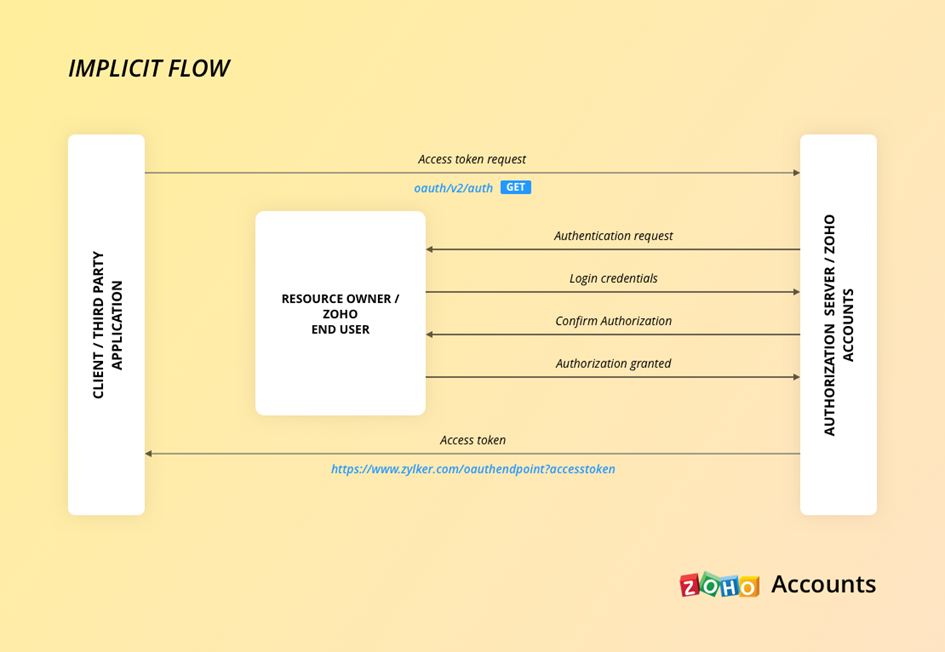

# dag 2 30/4/2024

### complete the design for the 3d viewer proof of concept

<figure><figcaption></figcaption></figure>

<figure><figcaption></figcaption></figure>

### verder gewerkt aan de cursus

de cursus is een hulpzaam in vergelijking met de tutorials op YouTube. De cursus legt duidelijk uit wat de functies van elk onderdeel zijn om een schoon 3d model te creëren.

#### learning progress:

```javascript
Geometry, mesh, textures, materials, camera, wireframes, debugUI, text
```

#### Ik heb zelf ook wat geëxperimenteerd om te zien wat er allemaal mogelijk is met three js:



<figure><figcaption></figcaption></figure>

