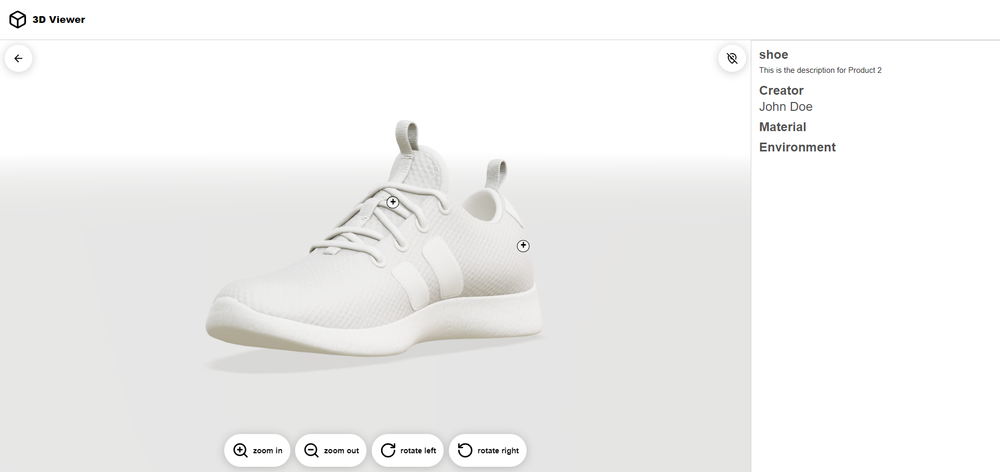

# dag 3 29/5/2024

### 3D scene:&#x20;

Na wat overleg hebben we besloten om de eerste versie te gebruiken en deze later bij te werken als we een betere oplossing vinden.

3d scene aangepast.

<figure><figcaption></figcaption></figure>

### loading circle&#x20;

Een SVG-loader toegevoegd die roteert door middel van CSS.

De loader wordt aangeroepen terwijl de 3D-modeldata aan het laden is.

<figure><figcaption></figcaption></figure>
