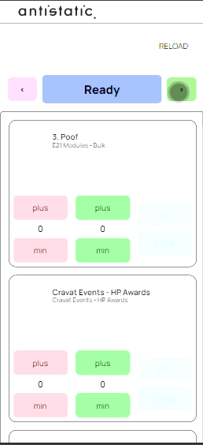

# dag 5 1/3/2024

### Design for product item detail page

Hier zijn twee mock-ups die ik heb gemaakt om de detailpagina weer te geven, zowel voor mobiel als desktop.

<figure><figcaption></figcaption></figure>

<figure><figcaption></figcaption></figure>

### research naar een alternatieve data fetching libary

Momenteel maken we gebruik van SWR voor het ophalen van gegevens. Ik ben bezig met onderzoek om te bepalen of dit de beste keuze is voor ons in 2024, maar ik ben nog niet klaar met mijn research.&#x20;

Ik evalueer momenteel verschillende bibliotheken voor gegevens ophalen op basis van hun compatibiliteit met React en TypeScript, de mate van langdurige ondersteuning, hun open source status, en hun succesvolle track record.

### begonnen met feat: Mobile overview page: column header

Ik heb media queries toegepast om de mobiele pagina aan te passen volgens de mock-up. Ik ben echter nog niet klaar; ik moet de CSS opruimen en de code optimaliseren.

<figure><figcaption></figcaption></figure>

<figure><figcaption></figcaption></figure>
